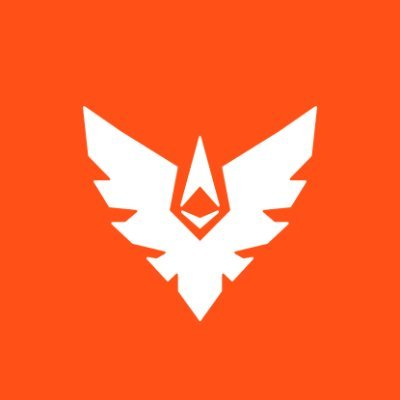
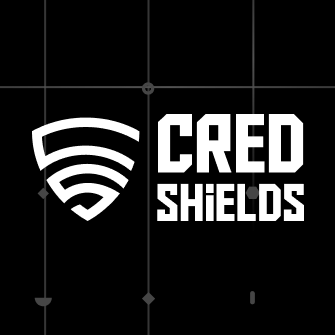

# 0xRayaa's Security Portfolio

I’m a security researcher specializing in **Solidity**, and **Rust** (Solana, CosmWasm) Smart Contract Audits, along with **Web2 application penetration testing**.  
To date, I’ve conducted **100+ private audits**, including **15+ Rust audits 🦀**, discovered **120+ Critical/High vulnerabilities**, and contributed to multiple **Web2 security** which includes Bugcrowd, HackerOne, CVEs, and government platforms.

I have audited a wide range of protocols, including:  
**DeFi protocols (AMMs, lending, borrowing), Staking vaults, NFT staking platforms, Tokenomics and reward mechanisms, Token launchers, Vesting and bonding curves, Cross-chain protocols, Governance modules, ERC20 & SPL tokens, Validator systems, Browser wallet extensions, Lottery mechanisms, and GameFi dApps (staking, lotteries, dice, slots).**

📩 Interested in working together?  
- Twitter/X: [@0xRayaa](https://x.com/OxRayaa)  
- Telegram: [@0xRayaa](https://t.me/OxRayaa)  

---

## 🔎 Public Audits — Contests & Bug Bounties

| Rank | Report | Description |Critical/High | Medium |LangEcosystem|
| ---- | ------ | ---------- | ------ | -----------| --------|
|   50   |  [Super DCA Liquidity Network](https://audits.sherlock.xyz/contests/1171)  | AMM, Uniswap V4 Hooks | 1             | 1      | ♦ EVM   |
|   74   |  [Rain Smart Contract Audit Contest](https://hackenproof.com/hackers/0xRayaa?tab=programs) | Decentralized Prediction Markets Protocol  | 1             | 2      | ♦ EVM   |
| 18   |  [Bid Beasts](https://codehawks.cyfrin.io/c/2025-09-bid-beasts/results?lt=contest&page=1&sc=xp&sj=reward&t=leaderboard)    | NFT MarketPlace       | 2 | 2 | ♦ EVM   |
|   20   |  [Calyx Smart Contract](https://hackenproof.com/hackers/0xRayaa?tab=programs) | Decentralized Prediction Markets Protocol  | 0             | 1      | ♦ EVM   |

---
## 🔐 Private Audits — Firm Engagement Review

| Firm | Report | Description |Critical/High | Medium |Lang/Ecosystem| 📑 |
| ----                                                                                  | ------               | ----------                   | ------ | -----------| --------|----|
|  Pashov Audits  | Nucleus              | Vault Contract               | - | - | ♦ EVM      | **Soon** |
|  Pashov Audits  | RAAC                 | Token and Minter Contract    | - | - | ♦ EVM      | **[🔗](audit-reports/pdfs/RegnumAurum-security-review_2026-01-23.pdf)**  |
|  Pashov Audits  | SpiceNet             | A Transaction Submission Api | - | - | Typescript |**Soon** |
|  Superteam           | Prime Skills (Draft) | GameFi                       | - | - | 🦀 Solana  | **[🔗](audit-reports/pdfs/WAGER_PROGRAM_SMART_CONTRACT_AUDIT%20(1).pdf)** |

---
## 🔐 Private Audits — CredShields 

## 📆 2026 Audits
Protocol | Description | Ecosystem | Language | Findings | 📑 |
|----------|-------------|-----------|----------|----------|----|
Ardentis | Lending, Borrowing (Morpho Fork) | ♦ EVM | Solidity | 7 (0C,1H,6M) | **Soon** |
HeyElsa | Staking | ♦ EVM | Solidity | 5 (0C,2H,3M) | **[🔗](audit-reports/pdfs/HeyElsa_Staking_Final_Audit_Report.pdf)** |
 ---

 
## 📆 2025 Audits
 Protocol | Description | Ecosystem | Language | Findings | 📑 |
|----------|-------------|-----------|----------|----------|----|
 Save Planet Earth | Staking | ♦ EVM | Solidity | 5 (2C,1H,2M) | **[🔗](https://github.com/Credshields/audit-reports/blob/master/SPE_Smart_Contract_Final_Audit_Report.pdf)** |
 Amgi Studios-2 | NFT Staking, Tokenomics | ♦ EVM | Solidity | 30 (16C,7H,7M) | **Soon** |
 Landslide | ICM (interchain Messaging) | ♦ EVM | Solidity | 7  (2C,0H,5M) | **[🔗](https://github.com/Sanket-722/Audits/blob/main/audit-reports/pdfs/Landslide_Final_Audit_Report.pdf)** |
 Artulabs Limited | Airdrop, SPL Tokens | 🦀 Solana | Rust | 5 (1C,2H,3M) | **[🔗](https://github.com/Credshields/audit-reports/blob/master/Artu_Rust_Final_Audit_Report.pdf)** |
 Amgi Studios-1 | NFT Staking, L1<>L2 RollUp | ♦ EVM | Solidity | 9 (4C,3H,2M) | **Soon** |
 Power Couple Coin: Staking | Staking | 🦀 Solana | Rust | 6 (4C,0H,2M) | **Soon** |
 Vouch | Tokenomics | ♦ EVM | Solidity | 7 (2C,0H,5M) | **[🔗](https://github.com/Credshields/audit-reports/blob/master/Vouch_Token_and_Distribution_Final_Audit_Report.pdf)** |
 Tarmiiz | Staking Vault | ♦ EVM | Solidity | 9 (2C,3H,4M) | **[🔗](https://github.com/Sanket-722/Audits/blob/main/audit-reports/pdfs/Tarmiiz_Final_Audit_Report.pdf)** |
 DotLabs: Mushi | DeFi, Lending/Borrowing | 🦀 Solana | Rust | 8 (1C,3H,4M) | **[🔗](https://github.com/Credshields/audit-reports/blob/master/Mushi_V2_0_Final_Audit_Report.pdf)** |
 Power Couple Coin | Staking, Lottery | 🦀 Solana | Rust | 9 (6C,0H,3M) | **[🔗](https://github.com/Credshields/audit-reports/blob/master/Lottery_Contracts_Final_Audit_Report.pdf)** |
 Power Couple Coin: Selltax | DeFi | 🦀 Solana | Rust | 9 (6C,0H,3M) | **Soon** |
 Power Couple Coin: StakingPanelty | Staking | 🦀 Solana | Rust | 5 (4C,0H,1M) | **Soon** |
 LERN360 |Staking| ♦ EVM | Solidity | 24 (6C,10H,8M) | **[🔗](audit-reports/pdfs/LERN360_ICO_Contracts_Final_Audit_Report.pdf)** |
 Fomodotbiz | AMM, Bonding Curve | ♦ EVM | Solidity | 6 (3C,0H,3M) | **[🔗](audit-reports/pdfs/Fomodotbiz_Final_Audit_Report.pdf)** |
 Safle Network | Cross-chain unified identity management | ♦ EVM | Solidity | 6 (2C,1H,3M) | **[🔗](audit-reports/pdfs/Safle_Final_Audit_Report.pdf)** |
 LERN360 | ERC20 | ♦ EVM | Solidity | 4 (0C,2H,0M,2L) | **[🔗](https://github.com/Credshields/audit-reports/blob/master/LERNToken_Final_Audit_Report.pdf)** |
 Power Couple Coin: Selltax | DeFi | 🦀 Solana | Rust | 9 (6C,0H,3M) | **Soon** |
 Power Couple Coin: StakingPanelty | Staking | 🦀 Solana | Rust | 5 (4C,0H,1M) | **Soon** 
 BRLA Digital | ERC20 Token Swap | ♦ EVM | Solidity | 14 (2C,0H,3M,9L) | **[🔗](https://github.com/Credshields/audit-reports/blob/master/BRLA_Final_Audit_Report.pdf)** |
 mew.gg | AMM | ♦ EVM | Solidity | 11 (0C,1H,0M,10L) | **[🔗](https://github.com/Credshields/audit-reports/blob/master/mew.gg_Contracts_Final_Audit_Report.pdf)** |
 Manadotwin | Vesting, Bonding Curve | ♦ EVM | Solidity | 5 (2C,1H,2M,0L) | **[🔗](https://github.com/Credshields/audit-reports/blob/master/Manadotwin_Final_Audit_Report.pdf)** |
 Zodor | Staking | ♦ EVM | Solidity | 7 (2C,0H,1M,4L) | **[🔗](https://github.com/Credshields/audit-reports/blob/master/Zodor_Staking_Final_Audit_Report.pdf)** |
 Metaco Intelligence Corporation | Restaking | ♦ EVM | Solidity | 13 (1C,2H,3M,7L) | **[🔗](http://github.com/Credshields/audit-reports/blob/master/Zoth_Final_Audit_Report.pdf)** |
 Avail | Chain Abstraction | ♦ EVM | Solidity | 4 (1C,0H,3M) | **[🔗](audit-reports/pdfs/Avail_Vault_Final_Audit_Report.pdf)** |
 Artulabs Limited | Vesting, ERC20 | ♦ EVM | Solidity | 9 (0C,1H,2M,5L) | **[🔗](https://github.com/Credshields/audit-reports/blob/master/Artu_Solidity_Final_Audit_Report.pdf)** |
 <!-- 
 W3.Labs | Staking Vault | ♦ EVM | Solidity | 13 (0C,0H,4M,9L) | **[🔗](https://github.com/Credshields/audit-reports/blob/master/W3.labs_Final_Audit_Report.pdf)** | 
 Zeroxcore | Token Distribution | 🦀 Solana | Rust | 3 (0C,0H,3M) | **Soon** | 
 Okidori: Boosterpack | NFT Rewards | ♦ EVM | Solidity | 5 (0C,1H,4M) | **[🔗](audit-reports/pdfs/Okidori_Booster_Pack_Final_Report.pdf)** |
 -->
 
---

## 📆 2024 Audits
 Protocol | Description | Ecosystem | Language | Findings | 📑 |
|----------|-------------|-----------|----------|----------|----|
 AllinGames: Bank | GameFi | 🦀 Cosmos (CosmWasm) | Rust | 9 (4C,0H,5M) | **[🔗](https://github.com/Credshields/audit-reports/blob/master/AllInGames_Bank_Final_Audit_Report.pdf)** |
 AllinGames: Coin Flip | GameFi | 🦀 Cosmos (CosmWasm) | Rust | 2 (1C,1H,0M) | **[🔗](https://github.com/Credshields/audit-reports/blob/master/AllInGames_Coin_Flip_Final_Audit_Report.pdf)** |
 AllinGames: Hash Dice | GameFi | 🦀 Cosmos (CosmWasm) | Rust | 2 (1C,1H,0M) | **[🔗](https://github.com/Credshields/audit-reports/blob/master/AllInGames_Hash_Dice_Final_Audit_Report.pdf)** |
 AllinGames: Lottery | GameFi | 🦀 Cosmos (CosmWasm) | Rust | 4 (2C,0H,1M,1L) | **[🔗](https://github.com/Credshields/audit-reports/blob/master/AllInGames_Lottery_Final_Audit_Report.pdf)** |
 Protop Vesting | Vesting | ♦ EVM | Solidity | 8 (1C,0H,0M,7L) | **[🔗](https://github.com/Credshields/audit-reports/blob/master/Protop_Vesting_Contracts_Final_Report.pdf)** |
 AllinGames: Classic | GameFi | 🦀 Cosmos (CosmWasm) | Rust | 7 (1C,0H,1M,5L) | **[🔗](https://github.com/Credshields/audit-reports/blob/master/AllInGames_Classic_Dice_Final_Audit_Report.pdf)** |
 Plutope | Token Launcher | ♦ EVM | Solidity | 12 (2C,0H,5M,5L) | **[🔗](https://github.com/Credshields/audit-reports/blob/master/Plutope_Final_Audit_Report.pdf)** |
 LogX | Validator | ♦ EVM | Solidity | 11 (3C,2H,2M,4L) | **[🔗](https://github.com/Credshields/audit-reports/blob/master/LogX_Token_Final_Report.pdf)** | 
 Arcana: Browser Extenstion | Wallet | ♦ EVM | Solidity | 5 (0C,0H,1M,4L) | **[🔗](https://github.com/Credshields/audit-reports/blob/master/Arcana_Wallet_Final_Audit_Report.pdf)** |  
 Arcana Staking | Staking | ♦ EVM | Solidity | 11 (0C,1H,0M,10L) | **[🔗](https://github.com/Credshields/audit-reports/blob/master/Arcana_Staking_Contract_Final_Audit_Report.pdf)** |
 AllinGames: Seven Up Seven Down | GameFi | 🦀 Cosmos (CosmWasm) | Rust | 5 (0C,0H,0M,5L) | **[🔗](https://github.com/Credshields/audit-reports/blob/master/AllInGames_Seven_Up_Seven_Down_Final_Audit_Report.pdf)** |
 AllinGames: Slot | GameFi | 🦀 Cosmos (CosmWasm) | Rust | 4 (0C,0H,0M,4L) | **[🔗](https://github.com/Credshields/audit-reports/blob/master/AllInGames_Slots_Final_Audit_Report.pdf)** |
 AllinGames: Roulette | GameFi | 🦀 Cosmos (CosmWasm) | Rust | 2 (0C,0H,0M,2L) | **[🔗](https://github.com/Credshields/audit-reports/blob/master/AllInGames_Roulette_Final_Audit_Report.pdf)** |
 Arcana: Browser Extenstion | Wallet | ♦ EVM | Solidity | 5 (0C,0H,1M,4L) | **[🔗](https://github.com/Credshields/audit-reports/blob/master/Arcana_Wallet_Final_Audit_Report.pdf)** |
 Lara Protocol | Staking | ♦ EVM | Solidity | 13 (0C,0H,5M,8L) | **[🔗](https://github.com/Credshields/audit-reports/blob/master/Lara_Liquid_Staking_Final_Audit_Report.pdf)** |
 Arcana Staking | Staking | ♦ EVM | Solidity | 11 (0C,1H,0M,10L) | **[🔗](https://github.com/Credshields/audit-reports/blob/master/Arcana_Staking_Contract_Final_Audit_Report.pdf)** |
 Tribally Games | GameFi | ♦ EVM | Solidity | 6 (0C,1H,0M,5L) | **[🔗](https://github.com/Credshields/audit-reports/blob/master/Tribally_Games_Final_Report.pdf)** |

 <!-- 
 HoldPlatform V2 | Token Holding | ♦ EVM | Solidity | 7 (0C,0H,3M,4L) | **[🔗](https://github.com/Credshields/audit-reports/blob/master/HoldPlatform_Final_Audit_Report.pdf)** |
 Lara Protocol | Staking | ♦ EVM | Solidity | 13 (0C,0H,5M,8L) | **[🔗](https://github.com/Credshields/audit-reports/blob/master/Lara_Liquid_Staking_Final_Audit_Report.pdf)** |
 AllinGames: Limbo | GameFi | 🦀 Cosmos (CosmWasm) | Rust | 9 (0C,0H,2M,7L) | **[🔗](https://github.com/Credshields/audit-reports/blob/master/AllInGames_Limbo_Final_Audit_Report.pdf)** |
 AllinGames: Bacarrat | GameFi | 🦀 Cosmos (CosmWasm) | Rust | 5 (0C,0H,1M,4L) | **[🔗](https://github.com/Credshields/audit-reports/blob/master/AllInGames_Baccarat_Final_Audit_Report.pdf)** | 
 AllinGames: Bacarrat | GameFi | 🦀 Cosmos (CosmWasm) | Rust | 5 (0C,0H,1M,4L) | **[🔗](https://github.com/Credshields/audit-reports/blob/master/AllInGames_Baccarat_Final_Audit_Report.pdf)** |
 AllinGames: Andar Bahar | GameFi | 🦀 Cosmos (CosmWasm) | Rust | 4 (0C,0H,0M,4L) | **[🔗](https://github.com/Credshields/audit-reports/blob/master/AllInGames_Andar_Bahar_Final_Audit_Report.pdf)** |
 AllinGames: Dragon Tiger | GameFi | 🦀 Cosmos (CosmWasm) | Rust | 4 (0C,0H,0M,4L) | **[🔗](https://github.com/Credshields/audit-reports/blob/master/AllInGames_Dragon_Tiger_Final_Audit_Report.pdf)** |
 -->

---

## 🕸️ Web2 Bug Bounties & CVEs
| Report                                                                                                                                                                                           | Bug Description | Severity |Application |
|------------------------------------------------------------------------------------------------------------------------------------------------------------------------------------------------ | --------------------- | -----|-----------------| 
 |[Stryker](https://bugcrowd.com/h/Sanket_722)  |    3 Bugs - Information Disclosure    |    Critical     |   Webapp    |
 |[Stryker](https://bugcrowd.com/h/Sanket_722)  |    2 Bugs - Stored and Blind XSS    |    Critical     |   Webapp    |
 |Ivanti🔒  |   Information Disclosure    |    Critical     |   Webapp    |
  |  [BitGo Managed Public Bug Bounty Engagement](https://bugcrowd.com/h/Sanket_722)  |   Business Logic Vulnerability    |    High     |   Webapp    |
   |[Decred](https://bounty.decred.org/hall-of-fame/)  |  Improper Restriction of Authentication Attempts    |    High     |   Webapp    |
 |ChargeOver 🔒  |    SSRF    |    High     |   Webapp    |
  | E-GOI 🔒  |    XSS    |    Medium        |  Webapp  |
   | [CVE-2023-3580 ](https://nvd.nist.gov/vuln/detail/CVE-2023-3580) |    HTML injection    |    Medium        |  Webapp  |
   |[CVE-2023-0827 ](https://nvd.nist.gov/vuln/detail/CVE-2023-0827) |    XSS    |    Medium        |  Webapp  |
  |[CVE-2023-1239 ](https://nvd.nist.gov/vuln/detail/CVE-2023-1239) |    XSS    |    Medium        |  Webapp  |
   |[Drugs.com](https://hackerone.com/drugs_com/thanks#:~:text=17-,spiderweb7,-17)  |    Improper Authentication - Generic    |    Medium        |   Webapp  |
   |[Tennessee Valley Authority](https://hackerone.com/reports/1276559) |    Improper Restriction of Authentication Attempts    |     High       |  Webapp  |
 |[University of Twente ](https://www.utwente.nl/en/cyber-safety/responsible/hall-of-fame/#:~:text=1-,sanket%20salavi,-1)      | Information Disclosure | High    | Webapp  |
  | [ National Australia Bank](https://bugcrowd.com/engagements/nationalaustraliabankog/hall_of_fames#:~:text=sjv-,Sanket_722,-prok3z)  |    Information Disclosure    |    Low     |   Webapp    |
   | [Kistler Company](https://bugcrowd.com/engagements/kistler-vdp/hall_of_fames#:~:text=Private%20user-,Sanket_722,-nthuong95)  |    Improper Restriction of Attempts    |    Low     |   Webapp    |
| [Thomson Reuters](https://hackerone.com/reports/1219922)     |   Information Disclosure     |    Low     |   Webapp    |
 |   Affinity 🔒  |    Information Disclosure    |    Low     |   Webapp    |

<!-- 

 ## 🏆 Audit Contests

_Public contest portfolio (coming soon):_

| Report | Description | Critical/High | Medium | Lang-Ecosystem | Platform |
|--------|-------------|---------------|--------|----------------|----------|
| — | — | — | — | — | — |
--->
---
**Last updated: 2026**
